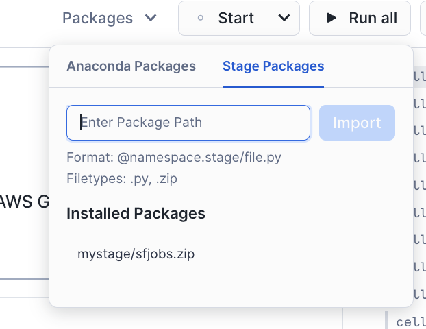

# Glue Helpers

If you had some AWS Glue Code that you want to adjust so you can run it in [Snowpark](https://docs.snowflake.com/en/developer-guide/snowpark/python/index)

These helpers provide some classes with very similar API.

They can be used in snowpark and can help to accelerate the migration of Glue scripts.

# Building the Helpers

To build the helpers, you need the [snow-cli](https://docs.snowflake.com/en/developer-guide/snowflake-cli-v2/index). Go to the command line and run:

`snow snowspark build`

This will build a file called `sfjobs.zip`

You can [upload this file to an snowflake stage using snowsight ](https://docs.snowflake.com/en/user-guide/data-load-local-file-system-stage-ui)or from the command line with the [snow-cli ](https://docs.snowflake.com/en/developer-guide/snowflake-cli-v2/index)(you can copy the file with `snow stage copy sfjobs.zip @mystage`)

In the releases for this repository you can download an already pre-built version.

# Using in notebooks

To use this in your notebooks (after uploading to an stage) go to packages and type the stage location.

