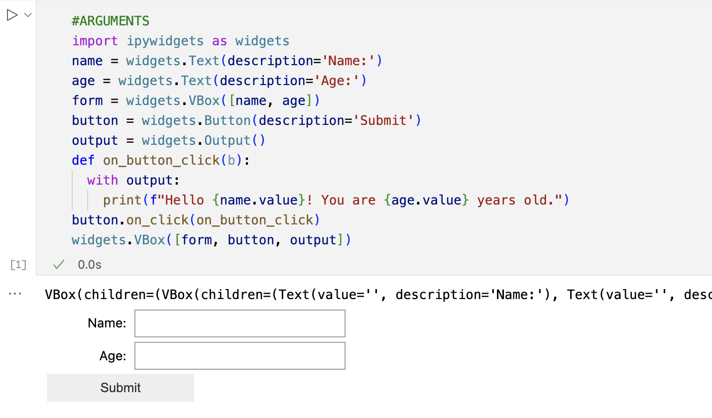

# Notebook Runner

The notebook runner is a procedure that can be used to run simple notebooks.
Let's say you have a notebook `example1.ipynb`` on stage `@notebooks` you can execute like:

```
call runner('@results','@notebooks/example1.ipynb',object_construct('name','Joe','age',20))
```

When the notebook ends it will save a notebook with the results in the indicated stage. A signed url that can be used to download the results will be returned.

# How to handle arguments

In your notebooks we recommend to put your widgets or logic for reading arguments in a cell with a marger comment `#ARGUMENTS`. For example:



The cells with this argument will be ignored. When the procedure is called it will inject the args into the notebooks context.

# Registering the script

```
Snowpark Extensions Extras
Notebook Runner procedure
=============================
usage: register.py [-h] [--stage STAGE] [--packages PACKAGES] [--imports IMPORTS]
                   [--procedure PROCEDURE] --connection [CONNECTION_ARGS ...]

optional arguments:
  -h, --help            show this help message and exit
  --stage STAGE         stage where the proc code will be uploaded
  --packages PACKAGES   packages that will be available for the notebook code
  --imports IMPORTS     imports that will be available for the notebook code
  --procedure PROCEDURE
                        procedure name
  --connection [CONNECTION_ARGS ...]
                        Connect options, for example snowsql, snowsql connection,env
```


In order to make it simple to register the proc you can run this script.

```
python register.py --procedure runner --connection json ~/credentials.json
```

It will:

1. connect to snowflake
2. registers the packages allowed for the proc
3. registes the imports allowed for the proc
4. publishes the store proc
